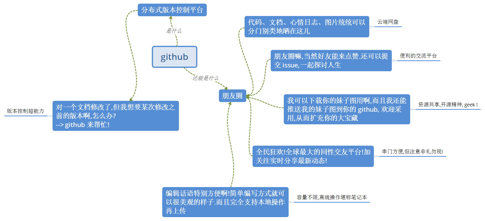

### Github

哈威小分队，如果能看到这里，希望能拉你进坑，git 真的挺好用。

> 匆匆赶制，难以言尽我想向你们安利 github 的情绪。

下面有一个比较生动地介绍。鸣谢"珊姗是个小太阳"。

[怎样使用 GitHub？--"珊姗是个小太阳"的回答](https://www.zhihu.com/question/20070065/answer/79557687)

或许使用 github 过程中，你还需要一些 [markdown](https://github.com/luanxxys/code/blob/master/markdown/readme.md) 的技能。

不用它也无所谓，全程使用 *.txt 不妨碍其便利性。
