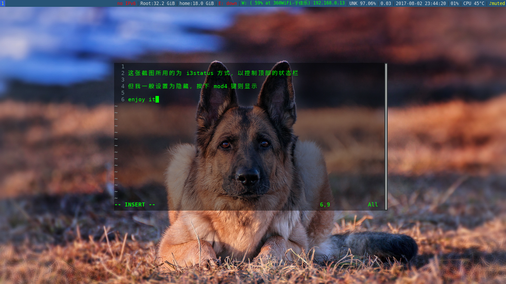
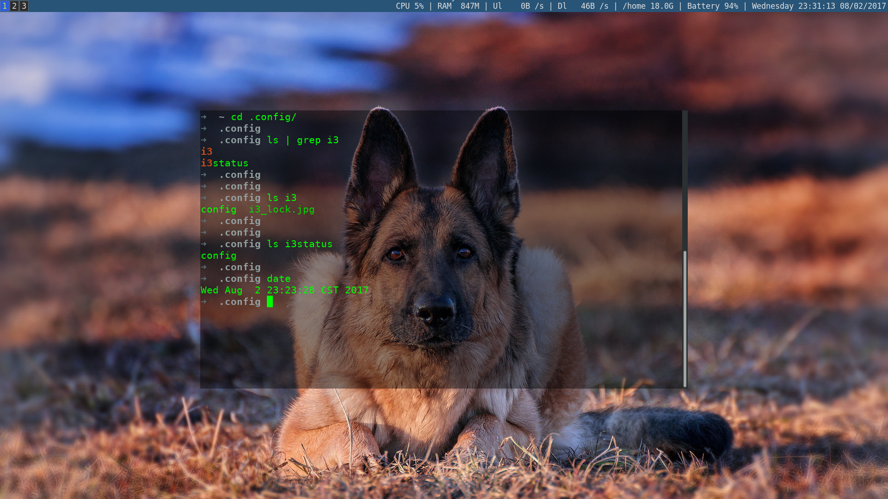

- ### REFERENCE

    + ### [i3 User’s Guide](https://i3wm.org/docs/userguide.html#_opening_terminals_and_moving_around)

    + ### [i3 wiki（简体中文）](https://wiki.archlinux.org/index.php/I3_(%E7%AE%80%E4%BD%93%E4%B8%AD%E6%96%87))

    + ### [Getting started with the i3 tiling window manager](https://fedoramagazine.org/getting-started-i3-window-manager/)

    + ### [dotshare.it](http://dotshare.it/category/wms/i3/)

    + ### [i3conf + i3status : 前辈定制](https://github.com/levinit/i3wm-config)

- ## 安装软件

    sudo dnf install mate-power-manager    
    > 主要用于笔记本调节亮度和方便电源管理

    sudo dnf install xcompmgr    
    > 使终端透明

    sudo dnf install feh    
    > 设置壁纸

    sudo dnf install alsa-utils（可选）
    > 音量管理

        终端下调节音量大小：

            $ alsamixer

- ## 将配置文件移到如下位置

        ～/.config/i3/config

- ## 配置 status bar：两种方式

    1. ### i3status

        用 i3wm 本身的 i3status 定义 toolbar
            cp /etc/i3status.conf ~/.config/i3status/config

        效果如图：
        

    1. ### conky

        vim ~/.conkyrc

        效果如图：
        

> 选择某种方式后，在 ～/.config/i3/conf 中作出相应修改

- ## 尚存问题

    1. 锁屏壁纸设置无效
    2. lantern 不可用
