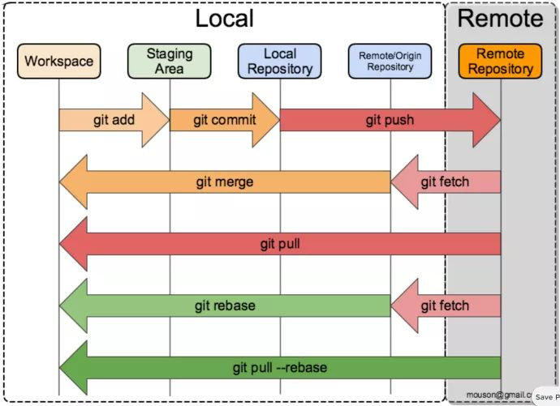

# Github on Linux

- ### 安装及设置

        $ sudo pacman -S git
        $ git config --global user.name "your account"
        $ git config --global user.email "email@example.com"

    > --global 参数，表示你这台机器上所有的 Git 仓库都会使用这个配置，当然也可以对某个仓库指定不同的用户名和 Email 地址

- ### 远程仓库

    

    + #### 本地 Git 仓库和 GitHub 仓库之间的传输是通过 SSH 加密的

        1. * ##### 创建 SSH Key

                $ ssh-keygen -t rsa -C "email@example.com"
            > 在用户主目录里找到 .ssh 目录，里面有 id_rsa 和 id_rsa.pub 两个文件，这两个就是 SSH Key 的秘钥对，id_rsa 是私钥，id_rsa.pub 是公钥

        1. * ##### 登陆 GitHub，`Account settings --> SSH Keys --> Add SSH Key`，填上任意 Title，在 Key 文本框里粘贴 id_rsa.pub 文件的内容

        > GitHub 只要知道了你的公钥，就可以确认只有你自己才能推送
        >
        > 可将密钥对保管好，多次使用（有安全隐患）

    + #### 本地仓库与 GitHub 仓库关联

            $ git remote add origin git@github.com:luanxxys/hello-world
        > 远程库的名字就是 origin，这是 Git 默认的叫法

        把本地库的所有内容推送到远程库上

            $ git push -u origin master
        > 用`git push`命令，实际上是把当前分支 master 推送到远程
        >
        > 由于远程库是空的，我们第一次推送 master 分支时，加上了 -u 参数，Git 不但会把本地的 master 分支内容推送的远程新的master分支，还会把本地的 master 分支和远程的 master 分支关联起来，在以后的推送或者拉取时就可以简化命令，使用命令`git push`推送最新修改

        要查看远程库的信息

            $ git remote (-v)

    + #### 从远程仓库克隆

            $ git clone git@github.com:luanxxys/hello-world
        > Git支持多种协议，默认的 git:// 使用 ssh，但也可以使用 https 等其他协议（clone 后面直接跟 URL）

        `git clone` 只能下载 master 分支到本地，若想下载全部分支

        * 查看全部分支

                $ git branch -a

        * 下载分支

                $ git checkout -b <local_branch> <remote_branch>
            > 若已存在本地分支名，则不用 -b 参数

    + #### 更新远程代码到本地仓库并查看差异

            $ git pull
            $ git diff HEAD^
        > 显示上一次提交之前工作目录与 git 仓库之间的差异

        **或者相对安全的方式**

            $ git fetch origin master:tmp
        > 从远程的 origin 仓库的 master 分支下载到本地并新建一个分支 temp
        
            $ git diff tmp
        > 比较 master 分支和 temp 分支的不同
        
            $ git merge tmp
        > 合并 temp 分支到 master 分支
        
            $ git branch -d temp
        > 删除此分支

- ### 创建版本库及添加文件

    + #### 创建一个新目录

            $ mkdir learn_git
            $ cd learn_git

    + #### 将创建的目录变成 Git 可以管理的仓库

            $ git init
        > git init learn_git

    + #### 把文件添加到版本库
    
        > 文件要在仓库中才能被 Git 识别

            $ git add readme.txt
        > 把文件添加到仓库

            $ git commit -m "massage"
        > 把文件提交到仓库

            $ git status
        > 查看添加结果

            $ git diff <file>
        > 查看修改内容

    所有的版本控制系统，其实只能跟踪文本文件的改动，比如 TXT 文件，网页，所有的程序代码等等，Git 也不例外。版本控制系统可以告诉你每次的改动，比如在第5行加了一个单词 “Linux”，在第 8 行删了一个单词 “Windows”。而图片、视频这些二进制文件，虽然也能由版本控制系统管理，但没法跟踪文件的变化，只能把二进制文件每次改动串起来，也就是只知道图片从 100KB 改成了 120KB，但到底改了啥，版本控制系统不知道，也没法知道。

- ### 版本回退

    + #### 查看提交历史，选择还原版本

            $ git log (--pretty=oneline)
        > --pretty=oneline参数减少输出信息
        >
        > Git的commit id 是一个 SHA1 计算出来的，用十六进制表示

    + #### 回退
        > 在 Git 中，用 HEAD 表示当前版本，上一个版本就是 HEAD^，上上一个版本就是 HEAD^^，当然往上 100 个版本写 100 个 ^ 比较容易数不过来，所以写成 HEAD~100

            $ git reset --hard HEAD^
            $ git reset --hard <commit_id>

    + #### 找不到新版本的 commit id，查看命令历史

            $ git reflog

- ### 工作区（working directory）
- 
    > 在电脑里能看到的目录，比如我的 learn_git 文件夹就是一个工作区

- ### 版本库（Repository）
  
    > 工作区有一个隐藏目录 .git，这个不算工作区，而是 Git 的版本库

- ### 暂存区（stage）
  
    > Git的版本库里存了很多东西，其中最重要的就是称为 stage（或者叫index）的暂存区，还有 Git 为我们自动创建的第一个分支 master，以及指向 master 的一个指针叫 HEAD

    + #### 把文件往 Git 版本库里添加

            $ git add .
            $ git commit -m "massage"

- ### 撤销修改

    + #### 丢弃工作区的修改（改乱了工作区某个文件的内容）

            $ git checkout -- readme.md
        > --很重要，没有--，就变成了“切换到另一个分支”的命令

        文件在工作区的修改全部撤销，这里有两种情况：

            * 一种是readme.txt自修改后还没有被放到暂存区，现在，撤销修改就回到和版本库一模一样的状态；

            * 一种是readme.txt已经添加到暂存区后，又作了修改，现在，撤销修改就回到添加到暂存区后的状态。

    + #### 把暂存区的修改撤销掉（unstage），重新放回工作区（不但改乱了工作区某个文件的内容，还添加到了暂存区时，想丢弃修改，下面是第一步）

            $ git reset HEAD readme.md
        > git reset命令既可以回退版本，也可以把暂存区的修改回退到工作区。当我们用HEAD时，表示最新的版本

- ### 删除文件

    直接在文件管理器中把没用的文件删了，或者用 rm 命令删了

        $ rm test.txt

    这个时候，Git 知道你删除了文件，因此，工作区和版本库就不一致了，`git status` 命令会立刻告诉你哪些文件被删除了

    这时有两个选择

    + 确实要从版本库中删除该文件，那就用命令 `git rm` 删掉，并且 `git commit`

    + 删错了，因为版本库里还有呢，所以可以很轻松地把误删的文件恢复到最新版本

            $ git checkout -- test.md
        > `git checkout` 其实是用版本库里的版本替换工作区的版本，无论工作区是修改还是删除，都可以“一键还原”

    命令 `git rm` 用于删除一个文件。如果一个文件已经被提交到版本库，那么你永远不用担心误删，但是要小心，你只能恢复文件到最新版本，你会丢失最近一次提交后你修改的内容

- ### 分支管理

    + #### 创建+切换分支

            $ git checkout -b dev
        > -b参数表示创建并切换，相当于以下两条命令

            $ git branch dev
        > 创建分支

            $ git checkout dev
        > 切换分支

    + #### 查看分支（当前分支前面会标一个*号）

            $ git branch (-a)

    + #### 合并某分支到当前分支

            $ git merge dev
        > Fast-forward信息，Git告诉我们，这次合并是“快进模式”，也就是直接把master指向dev的当前提交，所以合并速度非常快。当然，也不是每次合并都能Fast-forward

            $ git merge --no-ff -m "merge with no-ff" dev
        > --no-ff参数，表示禁用Fast forward,用普通模式合并，合并后的历史有分支，能看出来曾经做过合并，而fast forward合并就看不出来曾经做过合并

    + #### 删除本地分支

            $ git branch -d <branch_name>

    + #### 删除远程分支

        1. 查看

                $ git push origin -d <branch_name>

        1. 清理远程分支，把本地不存在的远程分支删除

                $ git remote prune origin
            > 推送一个空分支到远程分支，其实就相当于删除远程分支

        1. 更简单的方法是使用这个命令，它在 fetch之 后删除掉没有与远程分支对应的本地分支

                $ git fetch -p

    + #### 重命名远程分支

            $ git push --delete origin develop
        > 删除远程分支

            $ git branch -m devel develop
        > 重命名本地分支

            $ git push origin develop
        > 推送本地分支

    + #### 解决冲突

        Git无法执行“快速合并”，只能试图把各自的修改合并起来，但这种合并就可能会有冲突，必须手动解决冲突后再提交

        用带参数的git log也可以看到分支的合并情况

            $ git log --graph --pretty=oneline --abbrev-commit

        用 `git log --graph` 命令可以看到分支合并图

- ### 分支管理策略

    + #### bug 分支
    + 
        > 每个bug都可以通过一个新的临时分支来修复，修复后，合并分支，然后将临时分支删除。

        * ##### 把当前工作现场“储藏”起来

                $ git stash
            > 用git status查看工作区，就是干净的（除非有没有被Git管理的文件），因此可以放心地创建分支来修复bug

        * ##### 修复完成后，切换到master分支，并完成合并，最后删除issue-101分支

                $ git checkout master
                $ git branch -d issue-101

        * ##### 恢复现场

                $ git stash list
            > 查看之前储藏起来的工作区

                $ git stash apply
            > 恢复工作区

            但是恢复后，stash 内容并不删除，你需要用 *git stash drop* 来删除

                $ git stash pop

            `git stash list` 查看不到内容即为成功

            可以多次 stash，恢复的时候，先用`git stash list`查看，然后恢复指定的 stash，用命令

                $ git stash apply stash@{0}

            如果要丢弃一个没有被合并过的分支，可以通过强行删除

                $ git branch -D <branch>

    - #### 多人协作的工作模式

        + ##### 首先，可以试图推送自己的修改

                $ git push origin <branch-name>

        + ##### 如果推送失败，则因为远程分支比你的本地更新，需要先试图合并

                $ git pull

        + ##### 如果合并有冲突，则解决冲突，并在本地提交；没有冲突或者解决掉冲突后，再推送就能成功

                $ git push origin <branch-name>

        + ##### 如果 git pull 提示“no tracking information”，则说明本地分支和远程分支的链接关系没有创建，用命令

                git branch --set-upstream <branch-name> origin/<branch-name>

            当你的小伙伴从远程库clone时，默认情况下，你的小伙伴只能看到本地的master分支。可以用git branch命令查看。现在，你的小伙伴要在dev分支上开发，就必须创建远程origin的dev分支到本地，于是他用这个命令创建本地dev分支

                $ git checkout -b dev origin/dev

            现在，他就可以在dev上继续修改，然后，时不时地把dev分支push到远程

                $ git commit -m "add /usr/bin/env"
                $ git push origin dev

            你的小伙伴的最新提交和你试图推送的提交有冲突:先用 git pull 把最新的提交从 origin/dev 抓下来，然后，在本地合并，解决冲突，再推送

                $ git pull

            `git pull`也失败了，原因是没有指定本地 dev 分支与远程 origin/dev 分支的链接，根据提示，设置 dev 和 origin/dev 的链接

                $ git branch --set-upstream dev origin/dev

            再 pull

                $ git pull

- ### 标签管理
- 
    > 发布一个版本时，我们通常先在版本库中打一个标签（tag），这样，就唯一确定了打标签时刻的版本。将来无论什么时候，取某个标签的版本，就是把那个打标签的时刻的历史版本取出来。所以，标签也是版本库的一个快照。
    >
    > Git的标签虽然是版本库的快照，但其实它就是指向某个commit的指针，但不能像分支那样移动。

    + #### 切换到需要打标签的分支上

            $ git branch
            $ git checkout master

    + #### 打一个新标签（默认为 HEAD）

            $ git tag v1.0

    + #### 查看所有标签

            $ git tag

    + #### 对历史提交的 commit id 打标签

            $ git log --pretty=oneline --abbrev-commit
            $ git tag v0.9 6224937
        > 标签不是按时间顺序列出，而是按字母排序的

    + #### 可以创建带有说明的标签，用-a指定标签名，-m指定说明文字

            $ git tag -a v0.1 -m "version 0.1 released" 3628164

    + #### 可以通过 -s 用私钥签名一个标签

            $ git tag -s v0.2 -m "signed version 0.2 released" fec145a

    + #### 查看标签信息

            $ git show v0.9

    + #### 删除标签

            $ git tag -d v0.1

    + #### 推送某个标签到远程

            $ git push v1.0

    + #### 一次性推送全部尚未推送到远程的本地标签

            $ git push --tags

    + #### 获取远程tag

            $ git fetch origin tag <tagname>

    + #### 删除远程标签

            $ git tag -d v0.9
        > 先从本地删除

            $ git push origin :refs/tags/v0.9
        > 从远程删除
        
- ### 文件操作

        $ git ls-files
    > 列出各目录及相应目录下的文件

- ### 自定义 Git

    + #### 自动忽略文件

        在Git工作区的根目录下创建一个特殊的.gitignore文件，然后把要忽略的文件名填进去,最后把.gitignore也提交到Git

        有些时候，你想添加一个文件到Git，但发现添加不了，原因是这个文件被.gitignore忽略了。如果你确实想添加该文件，可以用-f强制添加到Git

            $ git add -f App.class

        或者你发现，可能是.gitignore写得有问题，需要找出来到底哪个规则写错了，可以用git check-ignore命令检查

            $ git check-ignore -v App.class

        Git会告诉我们，.gitignore 的第 3 行规则忽略了该文件，于是我们就可以知道应该修订哪个规则

    + #### 配置别名

            $ git config --global alias.st status
            $ git config --global alias.unstage 'reset HEAD'

        > --global参数是全局参数，也就是这些命令在这台电脑的所有Git仓库下都有用
        >
        > 配置Git的时候，加上--global是针对当前用户起作用的，如果不加，那只针对当前的仓库起作用
        >
        > 每个仓库的Git配置文件都放在.git/config文件中
        >
        > 当前用户的Git配置文件放在用户主目录下的一个隐藏文件.gitconfig中

    + #### 搭建 Git 服务器
