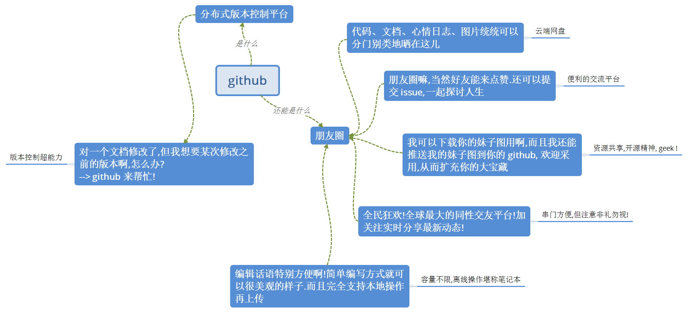

# Github

或许使用 github 过程中，你还需要一些 [markdown](https://github.com/luanxxys/code/blob/master/markdown/readme.md) 的技能。

### Reference

- [learn git](git_learn.md)
- [怎样使用 GitHub？--"珊姗是个小太阳"的回答](https://www.zhihu.com/question/20070065/answer/79557687)
- [git cheat sheet](git_cheat_sheet.md)
- [git cheat sheet - zh_CN](git_cheat_sheet_zh-CN.md)
- [github features](github_features.md)
