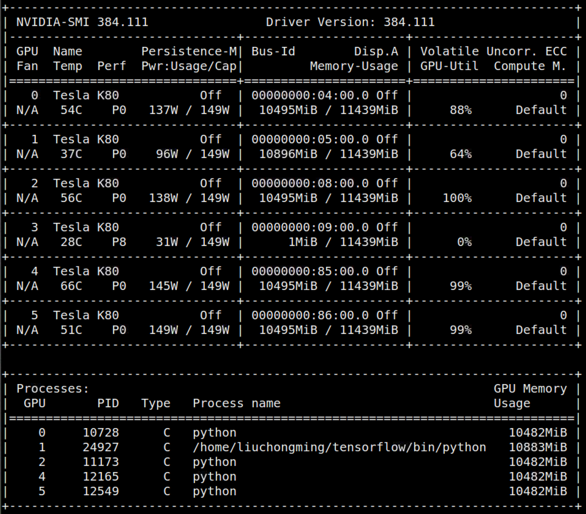

# 配置 Tensorflow GPU

## 查看 GPU 使用情况的命令

    nvidia-smi

> nvidia-smi -l # 动态持续显示

### 参数

+ Fan：代表显卡转速，以百分比显示 
+ Temp：代表显卡温度 
+ Perf：性能等级，p1~p12，数字越小，性能较好 
+ Pwr：usage/cap ：当前功率 / 总功率 
+ Memory-Usage: 显卡的显存使用容量跟显卡总的大小 
+ GPU-Util：显卡计算单元使用率 

> 显卡分为两部分，即显存与计算单元，类似与内存跟 CPU

## tensorflow 的显卡使用方式

1. ### 直接使用

        with tf.Session() as sess:

    这种方式会把当前机器上所有的显卡的剩余显存基本都占用。

1. ### 分配比例使用

        config = tf.ConfigProto()
        config.gpu_options.per_process_gpu_memory_fraction=0.6
        with tf.Session(config=config) as sess:

    占用每块显卡的 60%.

1. ### 动态申请使用

        config = tf.ConfigProto()
        config.gpu_options.allow_growth=True
        with tf.Session(config=config) as sess:

    动态申请显存，只会申请内存，不会释放内存。而且如果别人的程序把剩余显卡全部占了，就会报错。

1. ### 指定 GPU

    在有多块 GPU 的服务器上运行 tensorflow 的时候，可指定 GPU：

        import os
        os.environ["CUDA_VISIBLE_DEVICES"] = "2"

    或者运行程序时，使用下面方式

        CUDA_VISIBLE_DEVICES = 0，2
